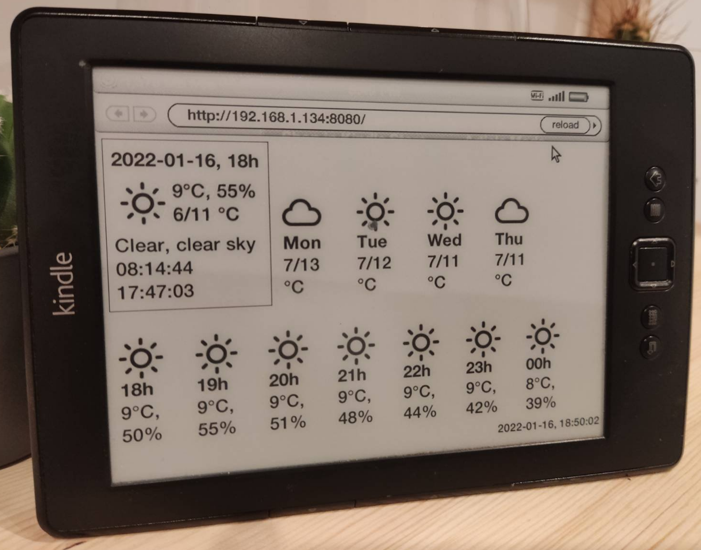

# kindle-weather

Icons in dir `icons` are from: https://erikflowers.github.io/weather-icons/

## Usage
- 1. To disable Kindle screensaver, in Search, type:
   - `;debugOn` then 'enter' button (in the virtual keyboard)
   - `~disableScreensaver` then 'enter' button
- 2. Generate an API key in https://openweathermap.org
- 3. Run the server: `go run *.go API_KEY`
   - Make sure to set your `lat` & `lon` in `main.go#L48`
- 4. In the Kindle go to "Experimental>Browser", load the server ip
